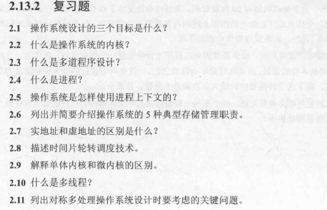
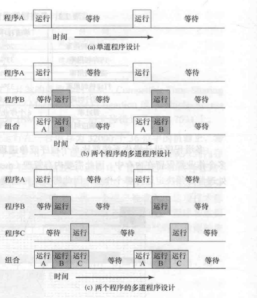
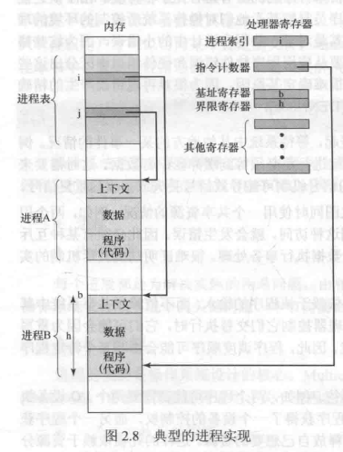
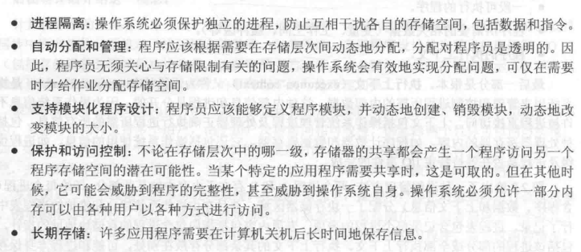
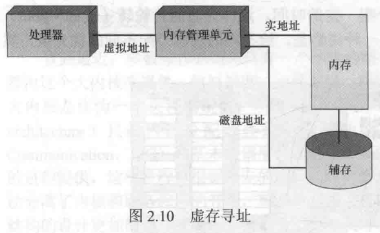
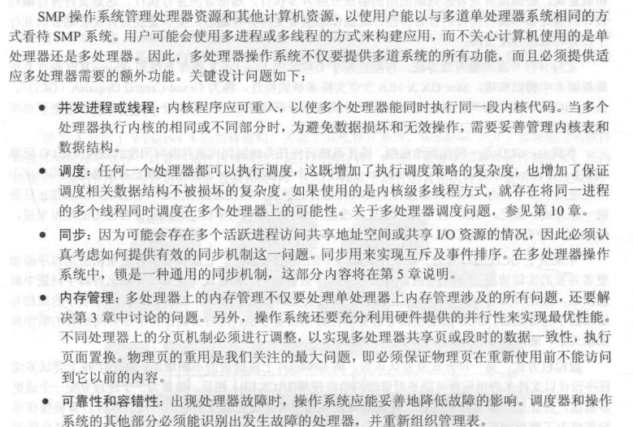

##### 2.1

方便、有效、易扩展

##### 2.2

内核是操作系统最常使用的部分，它存在于主存中并在特权模式下运行，响应进程调度和设备中断。 

##### 2.3

内核是操作系统最常使用的部分，它存在于主存中并在特权模式下运行，响应进程调度和设备中断。 

##### 2.4

- 一个正在执行的程序
- 计算机中正在运行的程序的一个实例
- 可分配给处理器并有处理器执行的有一个实体
- 由一个单一顺序线程、一个当前状态和一组相关的系统资源所表征的活动单元

##### 2.5

执行上下文又称为进程状态，是操作系统用来管理和控制所需的内部数据。上下文包括操作系统管理进程以及处理器正确执行进程所需要的所有信息，包括各种处理器寄存器的内容，如**程序计数器**和**数据寄存器**。它还包括操作系统使用的信息，如进程优先级以及进程是否在等待特定I/O事件的完成。

##### 2.6

##### 2.7

- 虚地址指的是存在于虚拟内存中的地址，它有时候在磁盘中有时候在主存中。 实地址指的是主存中的地址。
- 虚地址由页号和页中的偏移量组成。进程的每一页可以存在内存的任何地方，分页系统提供程序中使用过的虚地址和内存中的实地址或物理地址之间的动态映射

##### 2.8

- 操作系统维护了很多队列，每个队列代表等待某些资源的进程列表。短程列表由在内存中(或最基本的部分在其中)并等待处理器可用时随时准备运行的进程组成。
- 长程队列指等待处理器的新作业列表，操作系统通过把长程列队中的作业转移到短程队列中，实现向系统中添加作业的任务。

时间片轮转技术指的是依次给队列中的每个进程分配一定的时间

##### 2.9

##### 2.10

多线程技术指把执行一个应用程序的进程划分成可以同时运行的多个进程。

##### 2.11

