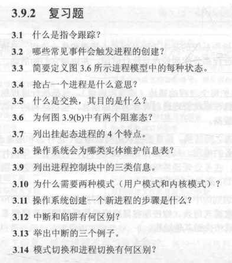
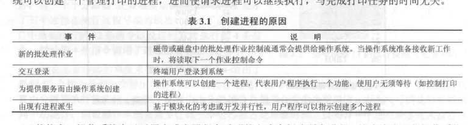
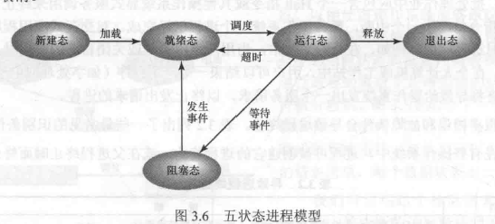
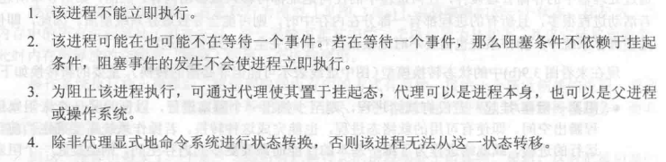
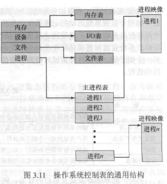
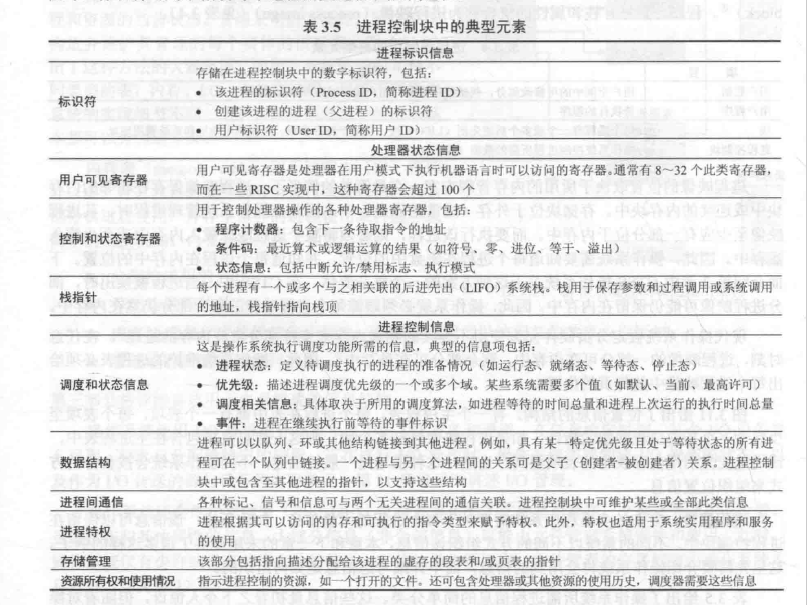
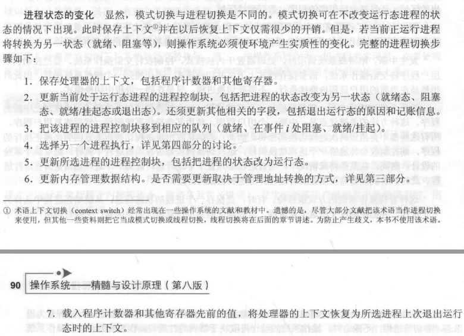

#####  3.1

指令跟踪是指为该进程而执行的指令序列。

#####  3.2

进程创建：将一个新进程添加到正被管理的进程集中，操作系统需要建立用于管理该进行的数据结构，并在内存中分配地址空间，这些行为构成一个新进程的创建过程。

#####  3.3

- 运行态：进程正在执行。
- 新建态:刚创建的进程，未加入可执行进程足，它通常是进程控制块已经创建但未加载到内存中的新进程。
- 就绪态：进程做好了准备，只要有机会就执行。
- 阻塞/等待态：进程在某些事件发生前不能执行
- 退出态：操作系统从可执行进程组释放出的进程，要么它自身已停止，要么它因某种原因被取消。

#####  3.4

处理器为了执行另外的进程而终止当前正在执行的进程，这就叫进程抢占。 

#####  3.5

- 交换是指把主存中某个进程的一部分或者全部内容转移到磁盘。当主存中没有处于就绪态的进程时，操作系统就把一个阻塞的进程换出到磁盘中的挂起队列，从而使另一个进程可以进入主存执行。
- 交换为I/O操作

#####  3.6

两个独立的概念：进程是否在等待一个事件（阻塞与否）以及进程是否已经被换出主存（挂起与否）。为适应这种2*2的组合，需要两个阻塞态和两个挂起态。

#####  3.7

#####  3.8

操作系统维护4种不同类型的表：

-  内存表：用于跟踪内存和外（虚）存。

- I/O表：管理计算机系统中的I/O设备和通道

- 文件表：提供关于文件是否存在、文件在外存中的位置、当前状态和其他属性的信息

- 进程表：管理进程的表

  

#####  3.9

- 进程标志信息  -->进程标识符（唯一）

- 进程状态信息

- 进程控制信息

  

  进程控制块都包含操作系统所需进程的所信息。操作系统的每一个模块都能读取和修改控制块。

#####  3.10

用户模式下可以执行的指令和访问的内存区域都受到限制。这是为了防止操作系统受到破坏或者修改。而在内核模式下则没有这些限制，从而使它能够完成其功能。

#####  3.11

- 为新进程分配一个唯一的进程标识符
- 为该进程分配空间
- 初始化进程控制块
- 设置正确的链接
- 创建或扩充其他数据结构

#####  3.12

中断与当前正在运行的进程无关的某些类型的外部事件相关，如完成一次I/O操作。陷阱与当前正在运行的进程所产生的错误或异常条件相关，如非法的文件访问。

#####  3.13

- 时钟中断
- I/O中断
- 内存失效

#####  3.14

发生模式切换可以不改变当前正处于运行态的进程的状态。发生进程切换（环境产生实质性变化）时，一个正在执行的进程被中断，操作系统指定另一个进程为运行态。进程切换需要保存更多的状态信息。