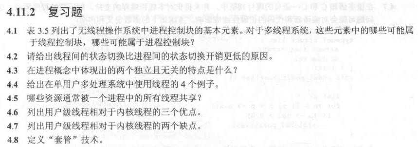
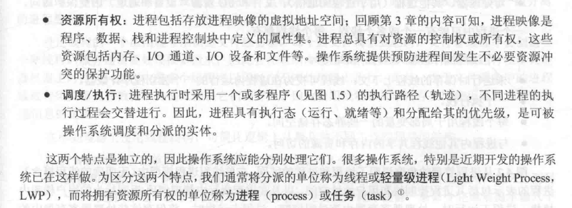
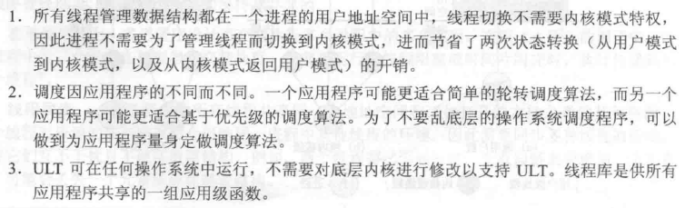
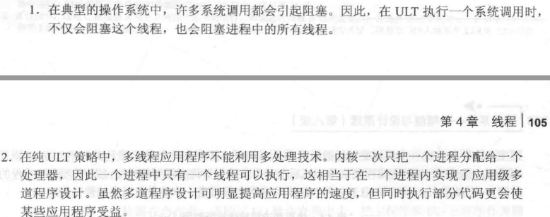

136

##### 4.1

##### 4.2

**进程**间切换的步骤：

- 1，保存程序计数其以及其他寄存器。
- 2， 更新当前处于“运行态”的进程的进程控制块，把[进程状态](https://www.baidu.com/s?wd=%E8%BF%9B%E7%A8%8B%E7%8A%B6%E6%80%81&tn=SE_PcZhidaonwhc_ngpagmjz&rsv_dl=gh_pc_zhidao)改为相应状态，更新其他相关域
- 3， 把被切换进程的进程控制块移到相关状态的队列
- 4， 选择另外一个进程开始执行，把该进程进程控制块的状态改为“运行态”
- 5， 恢复被选择进程的处理器在最近一次被切换出运行态时的上下文，比如载入[程序计数器](https://www.baidu.com/s?wd=%E7%A8%8B%E5%BA%8F%E8%AE%A1%E6%95%B0%E5%99%A8&tn=SE_PcZhidaonwhc_ngpagmjz&rsv_dl=gh_pc_zhidao)以及其他处理器的值

进程间切换伴随着两次模式切换（用户--内核，内核--用户）。

（同一进程内）**线程**间切换的步骤：

线程分两种，用户级线程和内核级线程

在用户级线程中，有关线程管理的所有工作都由应用程序完成，内核没有意识到线程的存在。

（同一进程内）用户级线程间切换时，只需要保存用户寄存器的内容，[程序计数器](https://www.baidu.com/s?wd=%E7%A8%8B%E5%BA%8F%E8%AE%A1%E6%95%B0%E5%99%A8&tn=SE_PcZhidaonwhc_ngpagmjz&rsv_dl=gh_pc_zhidao)，栈指针，不需要模式切换。

由于创建或撤销进程时，系统都要为之分配或回收资源，如内存空间、I/O 设备等，所付出的开销远大于创建或撤销线程时的开销。类似地，在进行进程切换时，涉及当前执行进程 CPU 环境的保存及新调度进程 CPU 环境的设置，而线程切换时只需保存和设置少量寄存器内容，开销很小。

##### 4.3

##### 4.4

- 前台和后台工作
- 异步处理
- 执行速度
- 模块化程序结构

##### 4.5

进程中的地址空间和其他打开的文件资源、执行特权。

##### 4.6

线程分成两大类，即用户级线程（ULT）和内核级线程（KLT），后者又称内核支持的线程或者轻量级进程

##### 4.7

##### 4.8

"套管"的目标是把一个产生阻塞的系统调用转化为一个非阻塞的系统的调用。