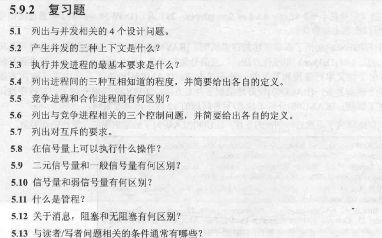
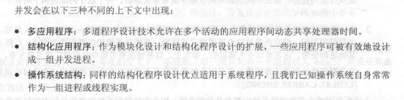
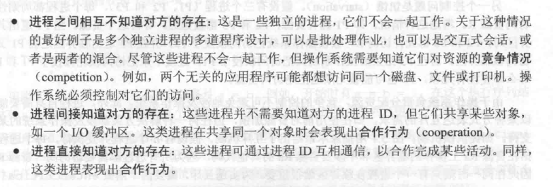
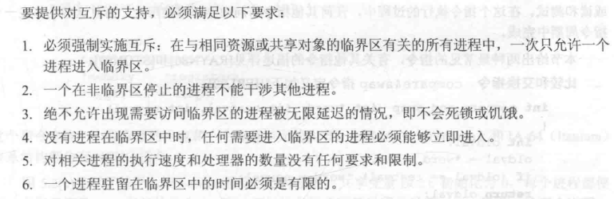
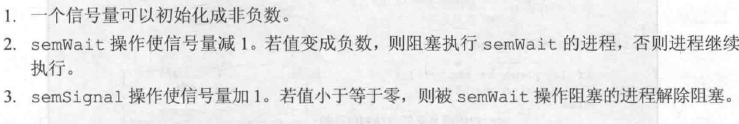
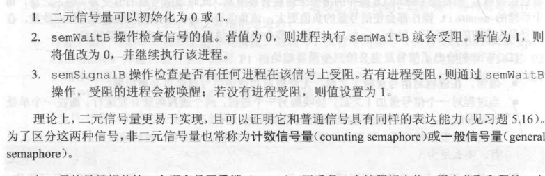
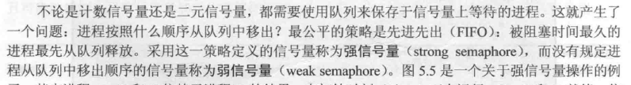
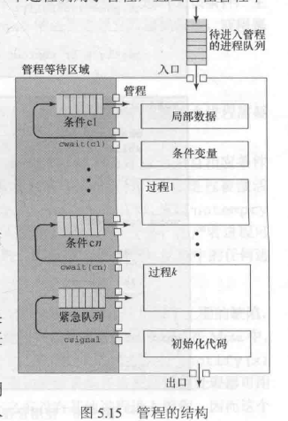
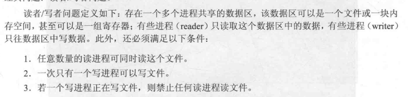

180

##### 5.1

- 进程间通信
- 资源共享与竞争
- 多个进程活动的同步
- 给进程分配处理器时间

##### 5.2

##### 5.3

并发的本质是互斥，加强互斥的能力

##### 5.4

##### 5.5

竞争进程需要同时访问相同的资源，像磁盘，文件或打印机。合作进程要么共享访问一个共有的资源，像一个内存访问区，要么就与其他进程相互通信，在一些应用程序或活动上进行合作。

##### 5.6

- 互斥：竞争进程仅可以访问一个临界资源（一次仅有一个进程可以访问临界资源），并发机制必须满足一次只有一个进程可以访问临界资源这个规则。
- 饥饿：一组进程的一个可能会无限期地拒绝进入到一个需要资源，因为其他 成员组成垄断这个资源。
- 死锁：如果竞争进程需要唯一的访问多于一个资源，并且当一个进程控制着一个进程，且在等待另一个进程，死锁可能发生。

##### 5.7

##### 5.8

##### 5.9

##### 5.10

##### 5.11

管程是由一个或多个过程，一个初始化序列和局部数据组成的软件模块。

##### 5.12

发送者和接收者任一方阻塞则消息传递需要等待，都无阻塞则不需等待。

##### 5.13

