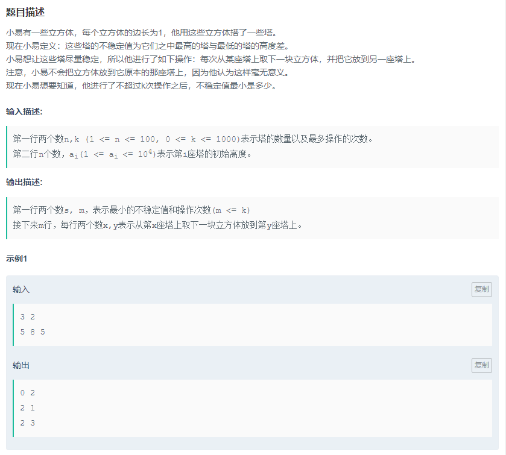

解题思路：

- 输入代表着 导入java.util.Scanner包

- 以后考虑自己创建一个对象进行对应操作。此题中涉及到大小值比较，考虑建立数组，实现Comparator<Clazz>接口，重写compare方法

  数组建立完毕之后通过如下例法进行大小值比较

  ```
  Arrays.sort(towers, new TowerComparator());
  ```

- 题中要求不稳定值，实际上就大小值的绝对差值。这就意味着，可以每次比较都把数组进行排序，然后最大值-1，最小值+1，用ArrayList记录这一操作。最后将结果打印出来

  ​

代码实现：

```java
import java.util.*;

public class Main {
     static class Tower{
            int height ;
            int index  ;
            public Tower (int height,int index){
                this.height = height;
                this.index = index;
            }
        }
    
   public static class TowerComparator implements Comparator<Tower> {
        public int compare(Tower t1, Tower t2) {
            return t1.height - t2.height;
        }
    }
    
    public static void main(String[] args) {
        Scanner in = new Scanner(System.in);
        int n = in.nextInt();
        int k = in.nextInt();   
        Tower[] towers = new Tower[n];
        for(int i = 0 ; i<n;i++ ){
            towers[i] = new Tower(in.nextInt(), i + 1);
        }
        
        List<String> lists = new ArrayList<>();
        Arrays.sort(towers, new TowerComparator());
        
        int diffCount = 0;
        while(towers[n-1].height- towers[0].height >0   && k>0   ){
            towers[0].height++;
            towers[n-1].height--;
            k--;
            diffCount ++;
            lists.add(towers[n - 1].index + " " + towers[0].index);
        
            Arrays.sort(towers, new TowerComparator());
        }
        
        System.out.println(towers[n-1].height- towers[0].height+" "+diffCount);

        for(int j =0 ; j<lists.size() ; j++){
            System.out.println(lists.get(j));
        }
    }
}
```

