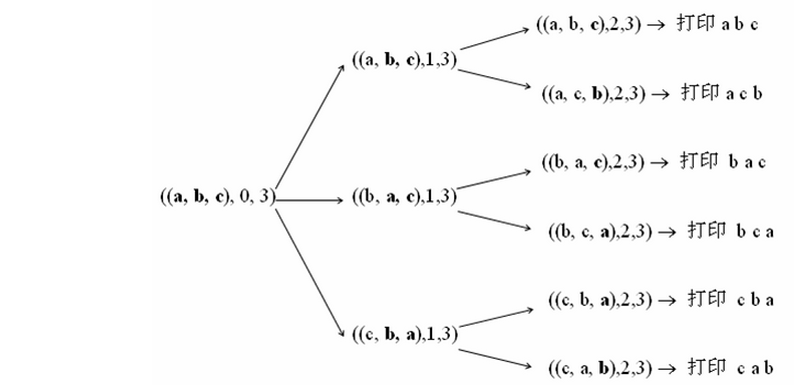
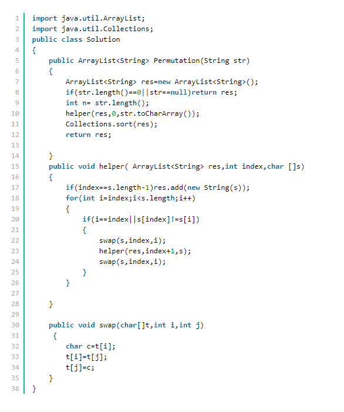

## 题目描述

输入一个字符串,按字典序打印出该字符串中字符的所有排列。例如输入字符串abc,则打印出由字符a,b,c所能排列出来的所有字符串abc,acb,bac,bca,cab和cba。

## 输入描述:

```
输入一个字符串,长度不超过9(可能有字符重复),字符只包括大小写字母。
```



## 思路分析

对于无重复值的情况：
     * 固定第一个字符，递归取得首位后面的各种字符串组合；
     * 再把第一个字符与后面每一个字符交换，并同样递归获得首位后面的字符串组合； *递归的出口，就是只剩一个字符的时候，递归的循环过程，就是从每个子串的第二个字符开始依次与第一个字符交换，然后继续处理子串。
 假如有重复值呢：
     * 由于全排列就是从第一个数字起，每个数分别与它后面的数字交换，我们先尝试加个这样的判断——如果一个数与后面的数字相同那么这两个数就不交换了。
     * 例如abb，第一个数与后面两个数交换得bab，bba。然后abb中第二个数和第三个数相同，就不用交换了。
     * 但是对bab，第二个数和第三个数不 同，则需要交换，得到bba。
     * 由于这里的bba和开始第一个数与第三个数交换的结果相同了，因此这个方法不行。
     * 换种思维，对abb，第一个数a与第二个数b交换得到bab，然后考虑第一个数与第三个数交换，此时由于第三个数等于第二个数， 所以第一个数就不再用与第三个数交换了。再考虑bab，它的第二个数与第三个数交换可以解决bba。此时全排列生成完毕

## 代码实现

```java
import java.util.*;

public class Solution {
    public ArrayList<String> Permutation(String str) {
         ArrayList<String> lists = new ArrayList<String>();
        //递归解决排列问题
        if(str!=null && str.length()>0){
            PermutationHelper(str.toCharArray(),0,lists);
            Collections.sort(lists);
        }
        return lists;
    }
    private void PermutationHelper(char[] chars,int i,ArrayList<String> lists){
        //如果此时索引到了尾字符，说明递归已经到了底层，将该字符转String，结果压入集合中
        if(i == chars.length-1){
            lists.add(String.valueOf(chars));
        }else{
            //HastSet由于Hashcode方法，不允许重复元素存在，起到去重作用
            Set<Character> charSet = new HashSet<Character>();
            //字符索引逐一向后移动并比较交换
            for(int j=i;j<chars.length;j++){
                if(j==i || !charSet.contains(chars[j])){
                    charSet.add(chars[j]);
                    //交换位置
                    swap(chars,i,j);
                    PermutationHelper(chars,i+1,lists);
                    //结束该层迭代，重置状态-返回上一层迭代
                    swap(chars,i,i);
                }
            }
        }
    }
 	
    private void swap(char[] cs,int i,int j){
        char temp = cs[i];
        cs[i] = cs[j];
        cs[j] = temp;
    }
}


import java.util.List;
import java.util.Collections;
import java.util.ArrayList;
 
public class Solution {
    public static void main(String[] args) {
        Solution p = new Solution();
        System.out.println(p.Permutation("abc").toString());
    }
 
    public ArrayList<String> Permutation(String str) {
        List<String> res = new ArrayList<>();
        if (str != null && str.length() > 0) {
            PermutationHelper(str.toCharArray(), 0, res);
            Collections.sort(res);
        }
        return (ArrayList)res;
    }
 
    public void PermutationHelper(char[] cs, int i, List<String> list) {
        if (i == cs.length - 1) {
            String val = String.valueOf(cs);
            if (!list.contains(val))
                list.add(val);
        } else {
            for (int j = i; j < cs.length; j++) {
                swap(cs, i, j);
                PermutationHelper(cs, i+1, list);
                swap(cs, i, j);
            }
        }
    }
 
    public void swap(char[] cs, int i, int j) {
        char temp = cs[i];
        cs[i] = cs[j];
        cs[j] = temp;
    }
}
```

