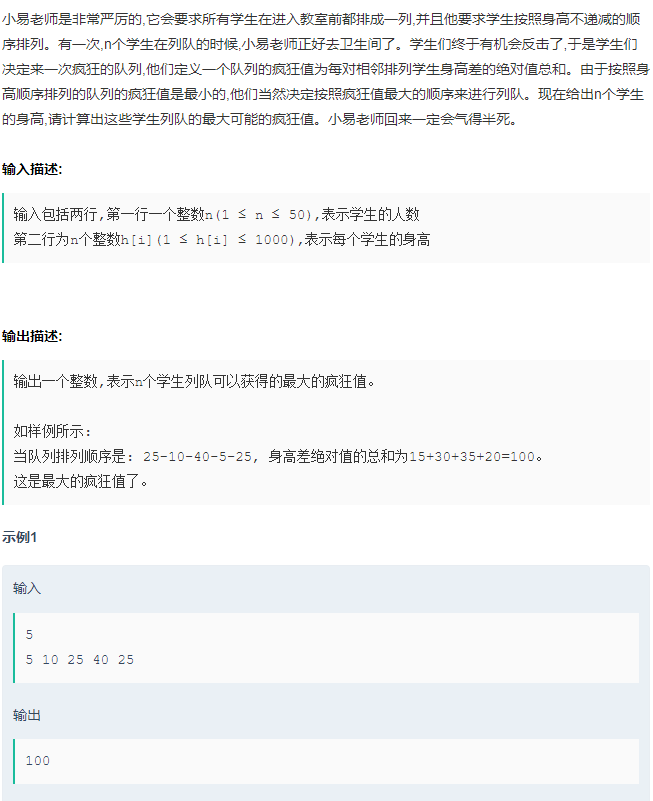

```java
import java.util.Arrays;
import java.util.Scanner;
 
public class Main {
    public static void main(String[] args) {
        Scanner in = new Scanner(System.in);
 
        while (in.hasNextInt()) {
            int n = in.nextInt();
            int[] nums = new int[n];
            for (int i = 0; i < n; i++) {
                nums[i] = in.nextInt();
            }
            Arrays.sort(nums);
             // 上一次加入疯狂队列的那个最小值
            int min = nums[0];      
             // 上一次加入疯狂队列的那个最大值
            int max = nums[n - 1];  
           
            int diff = max - min;
             // 未加入疯狂队列的最小值索引
            int minIndex = 1;       
            // 未加入疯狂队列的最大值索引
            int maxIndex = n - 2;   
           
            while (minIndex < maxIndex) {
                diff += max - nums[minIndex];
                diff += nums[maxIndex] - min;
                min = nums[minIndex++];
                max = nums[maxIndex--];
            }
            // 原数列中最后一个数 minIndex == maxIndex，将它放到合适的位置上
            diff += Math.max(nums[maxIndex] - min, max - nums[minIndex]);
            System.out.println(diff);
        }
    }
}
```


```java
https://www.nowcoder.com/questionTerminal/d996665fbd5e41f89c8d280f84968ee1

将原数列排好序，每次取数列中的最大与最小值加入到疯狂队列中（想象一下疯狂队列从中间向两边扩展），与上一次加入的最小与最大值交叉做差，直到原数列中仅剩最后一个值，把它放到疯狂队列合适的位置上保证疯狂值最大即可。

import java.util.Arrays;
import java.util.Scanner;
 
public class Main {
    public static void main(String[] args) {
        Scanner in = new Scanner(System.in);
 
        while (in.hasNextInt()) {
            int n = in.nextInt();
            int[] nums = new int[n];
            for (int i = 0; i < n; i++) {
                nums[i] = in.nextInt();
            }
            Arrays.sort(nums);
            int min = nums[0];      // 上一次加入疯狂队列的那个最小值
            int max = nums[n - 1];  // 上一次加入疯狂队列的那个最大值
            int diff = max - min;
            int minIndex = 1;       // 未加入疯狂队列的最小值索引
            int maxIndex = n - 2;   // 未加入疯狂队列的最大值索引
            while (minIndex < maxIndex) {
                diff += max - nums[minIndex];
                diff += nums[maxIndex] - min;
                min = nums[minIndex++];
                max = nums[maxIndex--];
            }
            // 原数列中最后一个数 minIndex == maxIndex，将它放到合适的位置上
            diff += Math.max(nums[maxIndex] - min, max - nums[minIndex]);
            System.out.println(diff);
        }
    }
}
```


